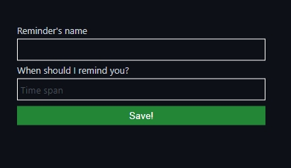

# Code-Remind for Visual Studio Code

👋🏻 Welcome! 👋🏻 

[The VS Code `code-remind` extension](https://marketplace.visualstudio.com/items?itemName=flamingsoul2.code-remind)
provides a convenient way to set in-code reminders for your future self.

Whether you are new to `forgetting things` or an experienced `time-manager`, I hope this
extension will fit your needs and enhance your development experience by reminding you of your bad code that needs refactoring.

## Quick Start

- **Step 1.** Install the extension (obviously)

- **Step 2.** To start using the extension, open any directory or workspace
  containing code.

- **Step 3.** The `Reminder: Put reminder on current line` will appear as a new option under vscode's text editor context menu. **Click on it.**

- **Step 4.** Fill in the custom reminder form.
   

🎉🎉🎉 &nbsp;&nbsp; You are ready to Go :-) &nbsp;&nbsp; 🎉🎉🎉  
Now you'll be notified when the time comes.

## Upcoming Features

- [ ] Snooze notification for custom provided time
- [ ] General purpose repeatable reminders, (e.g. reminder for that meeting every Monday morning)
- [ ] Set reminders with comments e.g.

      // REMINDME: 13.07.2022 14:00 refactor

## License

[MIT](LICENSE)
